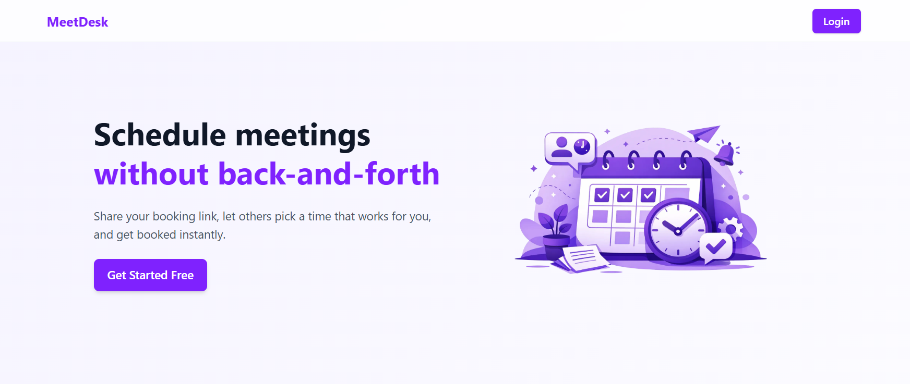

# [MeetDesk](https://meet-desk.onrender.com)

MeetDesk is a full-stack appointment booking application that allows users to book meetings via a public link while enabling admins to manage availability, bookings, and schedules through a secure dashboard.

## Features

### Public Booking

- Shareable booking link
- Date-based availability
- Slot selection & booking

### Admin Dashboard

- Create availability (date, start time, end time, slot duration)
- View and manage availability
- View all bookings
- Filter bookings by date
- Cancel bookings

## Tech Stack

### Frontend

- React.js (Vite)
- React Router
- Axios
- Tailwind CSS
- React Hooks

### Backend

- Node.js
- Express.js
- MongoDB
- Mongoose
- JWT Authentication
- REST APIs

## Authentication & Authorization

- JWT-based authentication
- Protected admin routes
- Public booking access without authentication
- Role-based access control

## Contact

_For any inquiries or feedback, please contact:_

### Ravikant Tarare

📩 [ravikanttarare2001@gmail.com](mailto:ravikanttarare2001@gmail.com)

📞 [+91-8275957698](tel:+918275957698)
